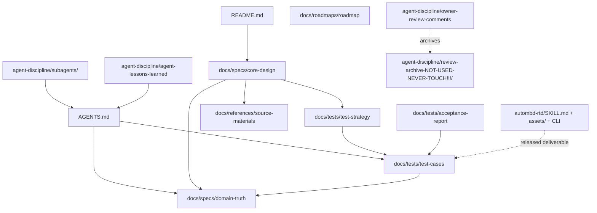

# RTD CfgFile CLI Documentation Governance

| Field | Value |
| --- | --- |
| Version | 0.1.5 |
| Date | 2026-06-29 |
| Author | autoMBD <tkung.lqk@foxmail.com> (AI-assisted) |
| Description | Documentation-governance rules for the RTD CfgFile CLI project. Defines the two-category split, official tool name, changelog integrity, archive policy, and the authoritative cross-category documentation map. |

## Governance rules

### Official tool name

The official tool name in all active documentation is **RTD CfgFile CLI**.

### Two-category documentation split

All project documents fall into exactly one of two physically separated
categories:

- **Category A — Development documentation** (`docs/`): pure project and
  engineering content; self-contained and agent-agnostic. Contains zero
  agent-discipline content and carries no pointers or links to agent-discipline
  documents. Includes specs (architecture, domain truth), test documents
  (strategy, cases, acceptance report), the roadmap, and references.
- **Category B — Agent discipline** (`AGENTS.md` at repo root,
  `agent-discipline/subagents/`, and `agent-discipline/`): agent charter, role definitions, iteration loop,
  KPI policies, review records, lessons learned, and this governance document.

Cross-category pointers are allowed from Category B to Category A (e.g.,
`AGENTS.md` referencing domain-truth or test cases), but never from Category A
to Category B.

### Specs stay at architecture altitude — milestone-free

Documents under `docs/specs/` (including their diagrams and goal tables) must
not reference a specific milestone, stage, schedule, or time-plan wording such
as "first/later/M1". Delivery staging lives only in
`docs/roadmaps/rtd-config-roadmap.md`. This rule exists because milestone
wording repeatedly leaked into specs across review rounds.

### Category A purity sweep

When reorganizing or auditing documentation, the Category A purity check must be
**repo-wide over all of `docs/`** — not scoped to the files a change happened to
touch. Grep for the agent-discipline lexicon
(`orchestrat|explorer|worker|tester|reviewer|subagent|main agent|KPI[- ]optim|convergence gate|iteration loop`),
excluding frozen changelog rows and `agent-discipline/review-archive-NOT-USED-NEVER-TOUCH!!!/`. The only
permitted survivors in `docs/` are the `Subagent Prompt` column name (a data
contract parsed by `tools/blackbox_e2e.py`, its unit tests, and its help text)
and references to `tools/blackbox_e2e.py` itself (committed project tooling).

### Changelogs are append-only

Changelog tables are append-only history records. Never merge, collapse, or
summarize existing changelog rows. New rows are added at the top or bottom
(consistently within each document).

### Review archive is read-only

`agent-discipline/review-archive-NOT-USED-NEVER-TOUCH!!!/` (formerly
`docs/OBSOLETE_NEVER_TOUCH!!!/`) contains frozen review archives only. These
files are unavailable as requirements sources and must not be read to infer
current behavior, scope, terminology, or acceptance criteria. Their contents
must never be edited.

### File header convention

Source and script files (`.py`, `.c`, `.h`, …) carry the uniform MIT file header
per `.claude/skills/common-uniform-file-header`. Project Markdown documents do
**not** use the MIT banner: they start directly with a `# Title` followed by a
metadata table (Version, Date, Author, Description), matching every existing
project doc.

## Documentation map

The authoritative map of all project documents, organized by category. All
paths are relative to the repository root.

### Category A: Development documentation (`docs/`)

| Document | Role | References |
| --- | --- | --- |
| `docs/specs/rtd-config-core-design.md` | Long-term architecture, CLI/JSON contract, goals, engineering constraints, minimal-system definition | domain-truth, test strategy, test cases, source materials |
| `docs/specs/rtd-config-runtime-safety-and-contract-design.md` | Runtime trust-boundary design: project identity, assets, diagnostics, secure transactions, provider ownership, descriptor inventory, and release integrity | core design, domain truth, test strategy |
| `docs/specs/rtd-config-domain-truth.md` | Per-module truth sourcing rule; vendor validation flow + gate; fixture role | source materials |
| `docs/specs/figures/` | Editable architecture figures (drawio + spec) | — |
| `docs/tests/rtd-config-test-strategy.md` | Test method: layers, gate, acceptance rule, hygiene | domain-truth, test cases |
| `docs/tests/rtd-config-test-cases.md` | E2E acceptance case catalog (`RTD-MEX-*`) | test strategy, domain-truth, fixtures |
| `docs/tests/rtd-config-acceptance-report.md` | Recorded acceptance evidence and current status | test cases, test strategy |
| `docs/roadmaps/rtd-config-roadmap.md` | **The only place stages live**: the basic delivery route | — |
| `docs/references/rtd-config-source-materials.md` | Catalog of development-time inputs (Excel, `.xdm`, vendor docs) | — |

### Category B: Agent discipline

| Document | Role | References |
| --- | --- | --- |
| `AGENTS.md` | Agent charter: orchestrator duties, four roles, iteration loop, convergence gate, KPI policies, documentation discipline | domain-truth, agent-lessons-learned, test cases |
| `agent-discipline/subagents/explorer.md` | Explorer role definition | AGENTS.md, domain-truth |
| `agent-discipline/subagents/worker.md` | Worker role definition | AGENTS.md, domain-truth |
| `agent-discipline/subagents/tester.md` | Tester role definition | AGENTS.md, test cases |
| `agent-discipline/subagents/reviewer.md` | Reviewer role definition | AGENTS.md, agent-lessons-learned |
| `agent-discipline/skills/external-dependency-memory/SKILL.md` | Skill for reusing local external dependency evidence across agents and conversations | AGENTS.md, source materials |
| `agent-discipline/owner-review-comments.md` | Review-comment resolutions across rounds | agent-discipline/review-archive-NOT-USED-NEVER-TOUCH!!!/ |
| `agent-discipline/agent-lessons-learned.md` | Reviewer's running lessons log | — |
| `agent-discipline/documentation-governance.md` | This document: governance rules + documentation map | — |
| `agent-discipline/implementation-plans/` | Executable Agent-development plans kept outside Category A engineering documentation | Category A specs and tests |
| `agent-discipline/review-archive-NOT-USED-NEVER-TOUCH!!!/` | Frozen review archives — never a requirements source | — |

### Standalone deliverable

| Document | Role |
| --- | --- |
| `autombd-rtd/SKILL.md` | Released Agent Skill: how an agent drives the public CLI (self-contained; ships with `assets/` + CLI) |
| `README.md` | Entry point: status, quick start, repository layout |

## Changelog

| Date | Version | Description |
| --- | --- | --- |
| 2026-07-12 | 0.1.5 | Added the Category B implementation-plan directory to the authoritative documentation map. |
| 2026-07-12 | 0.1.4 | Added the runtime-safety and public-contract design to the authoritative Category A documentation map. |
| 2026-06-29 | 0.1.3 | Issue #35: renamed the read-only review archive to `agent-discipline/review-archive-NOT-USED-NEVER-TOUCH!!!/` to make its frozen status explicit; updated all active references (purity-sweep rule, archive policy, documentation map, mermaid diagram). Frozen changelog rows retain the historical path. |
| 2026-06-16 | 0.1.2 | Replaced the script-centered agent environment document with the lightweight external-dependency-memory skill entry. |
| 2026-06-15 | 0.1.1 | Added `agent-discipline/agent-environment.md` to the Category B documentation map for issue #11. |
| 2026-06-15 | 0.1.0 | Created per issue #7 documentation reorganization: established the two-category split, ported and updated the authoritative documentation map from the deleted core-design `## Documentation map` section (with all paths updated to new locations), and codified the governance rules (tool name, milestone-free specs, Category A purity sweep, append-only changelogs, read-only review archive, file header convention). |
