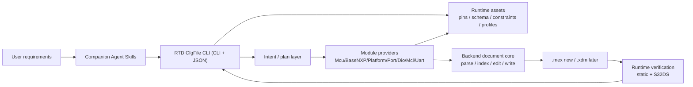

> **OBSOLETE - review archive only (round 4).** This is the reviewed draft of
> `docs/specs/rtd-config-core-design.md` with the user's inline REVIEW comments preserved for traceability.
> It is NOT a requirements source and must not be read to infer current
> behavior, scope, terminology, or acceptance criteria. Use only active
> documents outside `docs/OBSOLETE_NEVER_TOUCH!!!/`. Comment resolutions are
> tracked in `docs/common/rtd-config-core-comments-tracking.md`.

# RTD CfgFile CLI Core Design

| Field | Value |
| --- | --- |
| Version | 0.5.0 |
| Date | 2026-06-03 |
| Author | autoMBD <tkung.lqk@foxmail.com> (AI-assisted) |
| Description | Long-term architecture and goals for the RTD CfgFile CLI. Holds the stable CLI/JSON contract, module-ownership rules, and the subagent development workflow. Domain facts live in domain-truth; tests/acceptance live in the test strategy; .mex pitfalls live in the legacy-skills baseline. |

## Overview

RTD CfgFile CLI is a CLI-first system that edits RTD configuration files
(S32 ConfigTools `.mex` first, EB tresos `.xdm` later) by vendor rules, takes
structured requests, produces deterministic project edits, and verifies the
result through the vendor code-generation / validation flow. Companion Agent
Skills ship with it so AI agents can turn user requirements into intents,
run verification, and read diagnostics without touching implementation code.

The **stable external contract is the CLI and its JSON I/O.** Internal Python is
free to change behind that boundary.

This spec deliberately stays at the architecture/contract altitude. It does not
repeat: RTD enum/pin/fixture/S32DS facts (see `rtd-config-domain-truth.md`),
test cases (see `tests/rtd-config-m1-test-cases.md`) and the test
strategy/acceptance (see `tests/rtd-config-test-strategy.md`), `.mex`
editing pitfalls (see `rtd-config-legacy-skills-experience.md`), or the
per-module table (see `rtd-config-module-capabilities.md`). General software
practice (TDD, stdlib-first, structured-diagnostics-not-tracebacks) is assumed of
every agent and is not respecified here.

### Key terms (project-specific only)
- **Backend** — a configuration technology (`.mex` now, `.xdm` later); each owns
  its document model, writer, and validation integration.
- **Module provider** — code that plans/applies one RTD module and may write
  **only its owned region**; cross-module needs are explicit declared dependencies.
- **Runtime asset** — committed, versioned repo data (pin JSON, schema/constraint
  cache, manifests, validation profiles) the tool loads at runtime.
<!-- REVIEW: 在autombd-rtd/下，这些内容是放在data文件夹里的，有必要统一成asset -->
- **Runtime/development boundary** — runtime commands read only runtime assets;
  Excel, raw `.xdm`/`.epd`, deprecated skills, and RTD install scans are
  development-time inputs used to *build* assets, never read at runtime.
- **Runtime verification** — static checks first, then vendor (S32DS) validation.

## Goals

| ID | Goal | Success signal |
| --- | --- | --- |
| G01 | Deterministic CLI for RTD config-file edits. | Same project + assets + version + request → same plan, edits, diagnostics, verification. |
| G02 | Let agents configure RTD projects without driving vendor GUIs. | Agents turn requirements into JSON intents / shortcuts and complete configuration via the CLI. |
| G03 | Support agent requirement decomposition via companion skills. | Skills guide multi-signal analysis, pins, dependencies, and validation feedback before CLI calls. |
| G04 | Preserve module ownership and explicit dependencies. | Modules/features are added without entangling write ownership or hidden dependency edits. |
| G05 | Backend extensibility. | `.mex` first; EB tresos reuses intent/diagnostics/resources/capability/test concepts with its own document core. |
| G06 | Device/family/module/RTD-release growth. | Assets and capability metadata expand from S32K344/S32K3 RTD 7.0.1 outward. |
| G07 | Planned completion/creation of missing configuration. | When planned, the tool safely completes missing config or creates files from prepared templates. |
| G08 | Efficient enough for autonomous use. | Inspect/plan/check/resource/focused-configure are fast and expose timing data. |
| G09 | Vendor validation is the final authority, at full module parity. | Acceptance requires the S32DS gate (exit 0 + no SEVERE `[TOOL]`); **all seven M1 modules reach the same validated bar — they are equal priority.** |
<!-- REVIEW: G09不要提特定某个milestone，在milestone文件里确定具体执行情况，spec描述的是high level和architecture。已经犯过多次这样的错误了，把这一条也同步到 AGENTS.md 。 -->
<!-- REVIEW: 需要说明，对于backend .xdm，Vendor validation是EB tresos，不是S32DS。RTD CLI编辑 .xdm 时的Vendor validation和 .mex 要求一致 -->
<!-- REVIEW: 增加一个goal，明确最终的RTD CfgFile CLI要支持RTD Driver（覆盖所有模块）、RTD FresRTOS、RTD Stacks、RTD CDDs等。 -->

## Supported backends

| Backend | Format | Use |
| --- | --- | --- |
| S32 ConfigTools | `.mex` | S32DS ConfigTools projects (first) |
| EB tresos | `.xdm` + EB files | EB tresos projects (later, reusing the same concepts) |

## Architecture

Modular configuration core behind a CLI shell. Editable diagram:
`docs/common/figures/rtd-cfgfile-cli-architecture.drawio`.


<!-- REVIEW: 框图里的信息不要指示特定的milestone或plan，不要又later等时间计划信息，在milestone、plan文件里确定具体执行情况，spec描述的是high level和architecture。已经犯过多次这样的错误了，把这一条也同步到 AGENTS.md 。 -->

Layers: **CLI** (core commands + shortcuts that normalize to intent) → **Agent
Skills** (workflow adapters over the public CLI, never bypassing it) → **Intent/
plan** (normalize, resolve dependencies, diagnose, dry-run) → **Backend document
core** (parse/index/localized-edit/byte-faithful-write) → **Module providers**
(own plan+apply for one module) → **Shared services** (pins, schema/cache,
diagnostics, validation-command construction, config, timing).

**Two mandatory rules:**
1. A provider writes only the region it owns.
2. Shared concerns (document editing, pins, diagnostics, schema/constraints,
   validation) live in core/shared layers, never inside a module.

Cross-module dependencies are explicit plan relationships: a Uart request may
need Port pins, Mcu clocks, Mcl FlexIO, and Platform interrupts; each owning
provider plans and applies its own edits.

## Backend document core

Backend-specific; for `.mex` it must: parse and build only the indexes a command
needs; provide setting/container lookup + upsert; strip conflicting
`quick_selection` from modified elements; perform **narrow, byte-faithful
writes** (a no-edit write reproduces the file byte-for-byte; an owned edit
touches only changed lines); and surface diagnostics, never tracebacks. Concrete
`.mex` pitfalls and rules are in the legacy-skills baseline; RTD field/enum facts
are in domain-truth. EB tresos reuses these concepts with its own writer.

## Module capability model

Per-module responsibilities (actions, owned regions, dependencies, constraints,
shortcuts, tests) are summarized in `rtd-config-module-capabilities.md`. The
**authoritative per-module truth — valid values, constraints, and dependencies —
is each module's `<Module>.xdm`** ConfigTools descriptor. Each provider **owns**
its module's truth, extracted at development time from its `.xdm` into committed
per-module schema/constraint/dependency assets (domain-truth §1) — never ad hoc
code, a monolithic catalog, or runtime vendor-directory scans.

## Resource and constraint data

Runtime data is committed, versioned JSON/cache. Assets: module manifests +
capability metadata; **per-module schema/constraint/dependency cache extracted
from each `<Module>.xdm`** and owned by the provider (domain-truth §1);
**pin mapping by family/device/package/peripheral/signal/pin** (device-scoped,
built from the pin-mux source; current gaps in domain-truth §1); validation
profiles; generated-file/reference patterns.

```text
autombd-rtd/data/<vendor>/<family>/<module>/   # per-module cache from <Module>.xdm
autombd-rtd/data/nxp/s32k3/port/pins.json      # Port owns pin mapping (family-scoped)
autombd-rtd/data/nxp/s32k3/uart/               # Uart enum/constraint/dependency cache
```
<!-- REVIEW: 这是示例，所有模块都有这样的asset -->

Development-time source material (pin-mux Excel, RTD `.xdm`/`.epd`, ConfigTools
examples, validation references) is listed in the references doc and used only to
*build* assets.

<!-- REVIEW: 这里要link to rtd-config-source-materials.md -->

## Intent and commands

JSON intent is the core request format; shortcuts normalize to the same
plan/apply/check/validate pipeline. The CLI is non-interactive; run `plan` before
`configure` for review.

| Command | Purpose | Writes | Vendor |
| --- | --- | --- | --- |
| `inspect --project <p> --json` | Backend, device, package, RTD version, enabled modules, validation profile. | No | No |
| `plan --project <p> --intent i.json --json` | Normalize, resolve deps, check constraints, return planned edits/blockers. | No | No |
| `configure --project <p> --intent i.json --json` | Apply owned edits, then runtime verification. | Yes | Configurable |
| `check --project <p> --json` | Static checks only (fast tool-owned stage). | No | No |
| `validate --project <p> --json` | S32DS headless validation (gate: domain-truth §3). | No | Yes |
| `pin-options --device <d> --package <pkg> --peripheral <per> --json` | List valid pins/mux/direction for a signal from committed pin data. | No | No |

Shortcut groups (all normalize to intent): `uart` (LPUART/FlexIO channel,
baud/format, **interrupt method** — RTD has no polling value, DMA reserved),
`port` (generic pin mux / electrical), `dio` (channels/groups), `mcu`
(clocks/gates/modes), `platform` (IRQ entries), `basenxp` (OsIf), `mcl`
(FlexIO common; later DMA/eMIOS/TRGMUX/LCU).

<!-- REVIEW: 这里应该属于 rtd-config-module-capabilities.md 描述的内容，而不是在Spec中 -->

## Runtime configuration

JSON config (stdlib-only) for: backend; S32DS/EB roots; workspace; default
project; default family/device/package/RTD version; data/cache locations;
validation timeout; validation log dir. CLI flags override JSON.

## Diagnostics

All commands return stable JSON: `status` (`passed|failed|blocked`), `command`,
and a `diagnostics` list of `{severity, code, module, message, details}`.
Diagnostics must be actionable (name the module, the invalid/missing resource,
the failed constraint, and how to fix it).

## Runtime verification pipeline

`configure` runs: load config → load/index project → normalize intent → resolve
deps/constraints → plan → apply owned edits → **static checks** → **S32DS
validation when configured** → return changed modules, diagnostics, logs, status.
The exact S32DS command, exit codes, and the **exit-0-AND-no-SEVERE-`[TOOL]`
pass gate** are defined once in domain-truth §3. Static and vendor stages share
one result model but stay separate steps.

## Subagent development workflow

The product is built by an autonomous loop of four roles (`.claude/agents/`).
`main agent → Explorer → Worker → Tester → main agent` is one iteration:

- **Explorer** sources per-module truth from the module's `<Module>.xdm` into its
  committed provider asset (domain-truth §1), and confirms fixture state + the
  exact S32DS command.
- **Worker** implements one scoped capability TDD-first against that truth,
  inventing nothing.
- **Tester** runs the gate (deterministic suite + S32DS) and reports per-module
  PASS/FAIL with the exit code + SEVERE count.

The main agent routes on the result: **fail → next iteration (Explorer); pass →
Reviewer**. The **Reviewer** (context-isolated `fork_context:false`, only after
the gate is green) reviews the non-test requirements — domain values vs the
`.xdm`, uniform header / missed skill triggers, ownership/boundaries, test
adequacy, diff hygiene — and appends a **lessons-learned** entry
(`rtd-config-lessons-learned.md`). Tests are the convergence signal; the full
loop is specified in the test strategy.

<!-- REVIEW: fork_context:false是我在使用Codex时使用的参数，是否同样适用于Claude Code？这里明确是上下文隔离，具体参数由agent自己定。此外这里应该是Tester必须上下文隔离，而不是reviewer -->

## Fixtures

Real vendor projects grouped `fixtures/<vendor>/<backend: ds|eb>/<family>/<project>/` (`ds` = S32 Design Studio / ConfigTools `.mex`; `eb` = EB tresos),
including the files vendor validation needs and excluding build/generated
artifacts. Specific fixtures and scenarios are in the test strategy.

## Tests and acceptance

Defined by `tests/rtd-config-test-strategy.md` (the convergence contract —
layers, gate, acceptance rule, roles); the concrete M1 cases live in
`tests/rtd-config-m1-test-cases.md`. In short: tests are the sole "done" signal; acceptance requires the
deterministic suite, static checks, and the S32DS gate to pass; **Milestone 1 is
accepted only when all seven modules reach the validated bar**; independent
subagent validation is black-box and context-isolated; KPIs are 3 min focused /
5 min E2E / 10 min intervention.

## Success criteria

- core CLI commands return stable JSON; shortcuts normalize to one pipeline;
- companion skills guide agents without private implementation details;
- backend document cores configure projects through structured, narrow,
  byte-faithful edits following the legacy-skills baseline and domain-truth;
- providers preserve ownership; cross-module dependencies are explicit in plans;
- constraints/enums/pins come from committed assets + domain-truth, not ad hoc
  code or vendor scans;
- static and vendor diagnostics are actionable;
- **all seven M1 modules pass the S32DS gate (exit 0 + no SEVERE `[TOOL]`)** and
  the mandatory tests; focused validation meets the 3-minute KPI.

## Changelog

| Date | Version | Description |
| --- | --- | --- |
| 2026-06-03 | 0.5.0 | Major slim: removed the glossary/mechanics/duplicated KPI+boundary+S32DS prose; pointed domain facts to domain-truth, tests to the test strategy. Added seven-module parity (equal priority) with the S32DS pass gate as the acceptance bar, and the Explorer/Worker/Tester/Reviewer subagent workflow. |
| 2026-06-02 | 0.4.2 | M1 legacy-skills baseline + quick-selection handling requirement. |
| 2026-06-02 | 0.4.0–0.4.1 | Test class clarification; fixture layout; KPI/terminology. |
| 2026-05-30 | 0.1.0–0.3.0 | Initial design through third-round review. |
<!-- REVIEW: 为啥要把Changelog合并？不要这样做！ -->

<!-- REVIEW: 在这个core design文档中，添加一个所有文档的关联关系图谱，用以说明全部文档的组织架构、依赖关系、引用链接等信息。 -->