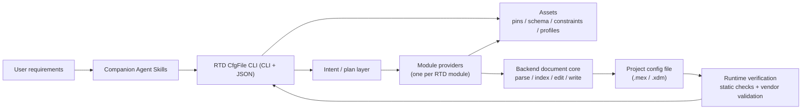
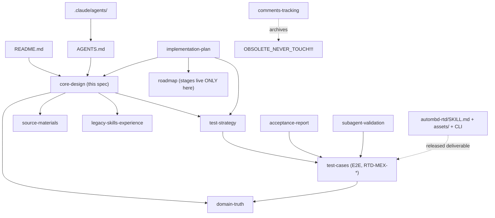

# RTD CfgFile CLI Core Design

| Field | Value |
| --- | --- |
| Version | 0.6.0 |
| Date | 2026-06-10 |
| Author | autoMBD <tkung.lqk@foxmail.com> (AI-assisted) |
| Description | Long-term architecture and goals for the RTD CfgFile CLI. Holds the stable CLI/JSON contract, module-ownership rules, the subagent development workflow, and the documentation map. Domain facts live in domain-truth; the test method lives in the test strategy; E2E cases live in the test-cases catalog; `.mex` pitfalls live in the legacy-skills baseline (references/). |

## Overview

RTD CfgFile CLI is a CLI-first system that edits RTD configuration files
(S32 ConfigTools `.mex` and EB tresos `.xdm`) by vendor rules, takes
structured requests, produces deterministic project edits, and verifies the
result through the vendor code-generation / validation flow. Companion Agent
Skills ship with it so AI agents can turn user requirements into intents,
run verification, and read diagnostics without touching implementation code.

The **stable external contract is the CLI and its JSON I/O.** Internal Python is
free to change behind that boundary.

This spec deliberately stays at the architecture/contract altitude — it carries
no milestone, schedule, or staging information (that lives only in the roadmap
and the implementation plan). It does not repeat: RTD enum/pin/fixture/S32DS
facts (see `rtd-config-domain-truth.md`), the test method and E2E cases (see
`tests/rtd-config-test-strategy.md` and `tests/rtd-config-test-cases.md`), or
`.mex` editing pitfalls (see `references/rtd-config-legacy-skills-experience.md`).
General software practice (TDD, stdlib-first,
structured-diagnostics-not-tracebacks) is assumed of every agent and is not
respecified here.

### Key terms (project-specific only)
- **Backend** — a configuration technology (`.mex`, `.xdm`); each owns its
  document model, writer, and vendor-validation integration.
- **Module provider** — code that plans/applies one RTD module and may write
  **only its owned region**; cross-module needs are explicit declared dependencies.
- **Asset** — committed, versioned data shipped under the skill's `assets/`
  directory (`autombd-rtd/assets/`): pin mapping JSON, per-module
  schema/constraint/dependency caches, manifests, validation profiles. "Asset"
  is the single term for this data; the tool loads it at runtime.
- **Runtime/development boundary** — runtime commands read only committed
  assets; Excel, raw `.xdm`/`.epd`, deprecated skills, and RTD install scans are
  development-time inputs used to *build* assets, never read at runtime.
- **Runtime verification** — static checks first, then vendor validation.

## Goals

| ID | Goal | Success signal |
| --- | --- | --- |
| G01 | Deterministic CLI for RTD config-file edits. | Same project + assets + version + request → same plan, edits, diagnostics, verification. |
| G02 | Let agents configure RTD projects without driving vendor GUIs. | Agents turn requirements into JSON intents / shortcuts and complete configuration via the CLI. |
| G03 | Support agent requirement decomposition via companion skills. | Skills guide multi-signal analysis, pins, dependencies, and validation feedback before CLI calls. |
| G04 | Preserve module ownership and explicit dependencies. | Modules/features are added without entangling write ownership or hidden dependency edits. |
| G05 | Backend extensibility. | Backends share the intent/diagnostics/asset/test concepts; each adds only its own document core and vendor-validation integration. |
| G06 | Device/family/module/RTD-release growth. | Assets and providers expand to new devices, families, and RTD releases without architecture change. |
| G07 | Planned completion/creation of missing configuration. | When planned, the tool safely completes missing config or creates files from prepared templates. |
| G08 | Efficient enough for autonomous use. | Inspect/plan/check/resource/focused-configure are fast and expose timing data. |
| G09 | Vendor validation is the final authority, at full module parity. | Acceptance requires the backend's vendor gate (for `.mex`: S32DS exit 0 + no SEVERE `[TOOL]`); **every supported module reaches the same validated bar — equal priority.** |
| G10 | Full RTD configuration surface. | RTD drivers (**all** modules), RTD FreeRTOS, RTD Stacks, and RTD CDDs are configurable through the same intent/provider/asset architecture; a module's surface is **all legal edits** defined by its descriptor. |

## Supported backends

| Backend | Format | Vendor validation |
| --- | --- | --- |
| S32 ConfigTools | `.mex` | S32DS ConfigTools headless (flow + gate: domain-truth §3) |
| EB tresos | `.xdm` + EB project files | EB tresos validation — **same requirements and gate semantics as `.mex`** (vendor tool exit + no severe configuration problem) |

Each backend owns its document model, writer, and validation integration behind
the shared intent/diagnostics/asset concepts. Vendor validation is mandatory for
every backend; only the vendor tool differs.

## Architecture

Modular configuration core behind a CLI shell. Editable diagram:
`docs/common/figures/rtd-cfgfile-cli-architecture.drawio`.



Layers: **CLI** (core commands + shortcuts that normalize to intent) → **Agent
Skills** (workflow adapters over the public CLI, never bypassing it) → **Intent/
plan** (normalize, resolve dependencies, diagnose, dry-run) → **Backend document
core** (parse/index/localized-edit/byte-faithful-write) → **Module providers**
(own plan+apply for one module) → **Shared services** (pins, schema/cache,
diagnostics, validation-command construction, config, timing).

**Two mandatory rules:**
1. A provider writes only the region it owns.
2. Shared concerns (document editing, pins, diagnostics, schema/constraints,
   validation) live in core/shared layers, never inside a module.

Cross-module dependencies are explicit plan relationships: a Uart request may
need Port pins, Mcu clocks, Mcl FlexIO, and Platform interrupts; each owning
provider plans and applies its own edits.

## Backend document core

Backend-specific; for `.mex` it must: parse and build only the indexes a command
needs; provide setting/container lookup + upsert; strip conflicting
`quick_selection` from modified elements; perform **narrow, byte-faithful
writes** (a no-edit write reproduces the file byte-for-byte; an owned edit
touches only changed lines); and surface diagnostics, never tracebacks. Concrete
`.mex` pitfalls and rules are in the legacy-skills baseline; RTD field/enum facts
are in domain-truth. The `.xdm` backend reuses these concepts with its own writer.

## Module providers and the editable surface

The tool's development goal is to support **every legal edit — every
configurable item — of every RTD module**. A module's editable surface, valid
values, constraints, and cross-module dependencies are defined by its
`<Module>.xdm` ConfigTools descriptor; each provider **owns** that truth,
extracted at development time into its committed per-module asset
(domain-truth §1) — never ad hoc code, a monolithic catalog, or runtime
vendor-directory scans. New modules — and non-driver surfaces such as RTD
FreeRTOS, RTD Stacks, and RTD CDDs (G10) — are added as providers under this
same architecture.

## Assets

Assets are committed, versioned JSON/cache files shipped under the skill's
`assets/` directory; runtime commands read nothing else. Asset kinds: module
manifests + metadata; **per-module schema/constraint/dependency caches extracted
from each `<Module>.xdm`** (provider-owned, domain-truth §1); **pin mapping by
family/device/package/peripheral/signal/pin**; validation profiles;
generated-file/reference patterns.

Example — **every module has an asset of this shape** (the tree below shows two
instances of the same pattern, not an exhaustive list):

```text
autombd-rtd/assets/<vendor>/<family>/<module>/   # per-module cache from <Module>.xdm
autombd-rtd/assets/nxp/s32k3/port/pins.json      # e.g. Port owns the family pin mapping
autombd-rtd/assets/nxp/s32k3/uart/               # e.g. Uart enum/constraint/dependency cache
```

Development-time source material (pin-mux Excel, RTD `.xdm`/`.epd`, ConfigTools
examples, validation references) is catalogued in
[`rtd-config-source-materials.md`](../references/rtd-config-source-materials.md)
and is used only to *build* assets.

## Intent and commands

JSON intent is the core request format; shortcuts normalize to the same
plan/apply/check/validate pipeline. The CLI is non-interactive; run `plan` before
`configure` for review.

| Command | Purpose | Writes | Vendor |
| --- | --- | --- | --- |
| `inspect --project <p> --json` | Backend, device, package, RTD version, enabled modules, validation profile. | No | No |
| `plan --project <p> --intent i.json --json` | Normalize, resolve deps, check constraints, return planned edits/blockers. | No | No |
| `configure --project <p> --intent i.json --json` | Apply owned edits, then runtime verification. | Yes | Configurable |
| `check --project <p> --json` | Static checks only (fast tool-owned stage). | No | No |
| `validate --project <p> --json` | Vendor headless validation (gate: domain-truth §3). | No | Yes |
| `pin-options --device <d> --package <pkg> --peripheral <per> --json` | List valid pins/mux/direction for a signal from the committed pin asset. | No | No |

Each supported module exposes a shortcut command group named after it (`uart`,
`port`, `dio`, `mcu`, `platform`, `basenxp`, `mcl`, …, growing as providers are
added). Every group normalizes to the same intent pipeline, and a group's
options cover its module's legal editable surface as defined by the
`.xdm`-derived asset.

## Runtime configuration

JSON config (stdlib-only) for: backend; vendor tool roots; workspace; default
project; default family/device/package/RTD version; asset/cache locations;
validation timeout; validation log dir. CLI flags override JSON.

## Diagnostics

All commands return stable JSON: `status` (`passed|failed|blocked`), `command`,
and a `diagnostics` list of `{severity, code, module, message, details}`.
Diagnostics must be actionable (name the module, the invalid/missing resource,
the failed constraint, and how to fix it).

## Runtime verification pipeline

`configure` runs: load config → load/index project → normalize intent → resolve
deps/constraints → plan → apply owned edits → **static checks** → **vendor
validation when configured** → return changed modules, diagnostics, logs, status.
For `.mex`, the exact S32DS command, exit codes, and the
**exit-0-AND-no-SEVERE-`[TOOL]` pass gate** are defined once in domain-truth §3.
Static and vendor stages share one result model but stay separate steps.

## Subagent development workflow

The product is built by an autonomous loop of four roles (`.claude/agents/`).
`main agent → Explorer → Worker → Tester → main agent` is one iteration:

- **Explorer** sources per-module truth from the module's `<Module>.xdm` into its
  committed provider asset (domain-truth §1), and confirms fixture state + the
  exact vendor-validation command.
- **Worker** implements one scoped capability TDD-first against that truth,
  inventing nothing.
- **Tester** runs the convergence gate: the deterministic suite, vendor
  validation, and the E2E acceptance cases. **E2E execution is
  context-isolated**: the executing agent sees only the released skill, the
  case's prompt, and the staged fixture — never this repository. Context
  isolation is the requirement; the mechanism is whatever the agent platform
  provides (a fresh, non-inherited context).
- The main agent routes on the result: **fail → next iteration (Explorer); pass
  → Reviewer**. The **Reviewer** (read-only, only after the gate is green)
  reviews the non-test requirements — domain values vs the `.xdm`, uniform
  header / missed skill triggers, ownership/boundaries, test adequacy, diff
  hygiene — and appends a **lessons-learned** entry
  (`rtd-config-lessons-learned.md`).

Tests are the convergence signal; the full loop is specified in the test
strategy.

## Fixtures

Real vendor projects grouped
`tests/fixtures/<vendor>/<backend: ds|eb>/<family>/<project>/` (`ds` = S32
Design Studio / ConfigTools `.mex`; `eb` = EB tresos), including the files
vendor validation needs and excluding build/generated artifacts. Fixture role
and usage are described in domain-truth §2; the E2E cases that consume them are
in the test-cases catalog.

## Tests and acceptance

Defined by `tests/rtd-config-test-strategy.md` (test layers, vendor gate,
acceptance rule, roles); the concrete E2E cases live in
`tests/rtd-config-test-cases.md` (scheme `RTD-MEX-*`). In short: tests are the
sole "done" signal; a module is accepted when the deterministic suite, static
checks, the vendor gate, and its E2E cases (context-isolated protocol) all
pass; **every supported module reaches the same validated bar**. Delivery
staging lives in the roadmap. KPIs: 3 min focused / 5 min E2E / 10 min
intervention.

## Success criteria

- core CLI commands return stable JSON; shortcuts normalize to one pipeline;
- companion skills guide agents without private implementation details;
- backend document cores configure projects through structured, narrow,
  byte-faithful edits following the legacy-skills baseline and domain-truth;
- providers preserve ownership; cross-module dependencies are explicit in plans;
- constraints/enums/pins come from committed assets, not ad hoc code or vendor
  scans;
- static and vendor diagnostics are actionable;
- **every supported module passes the vendor gate** (for `.mex`: exit 0 + no
  SEVERE `[TOOL]`) **and its E2E cases**; focused validation meets the 3-minute
  KPI.

## Documentation map

How the project's documents relate (who defines what, who references whom).
Staging/scheduling exists **only** in the roadmap; specs stay milestone-free.

| Document | Role | References |
| --- | --- | --- |
| `README.md` | Entry point: status, quick start, layout | core design, test strategy, test cases, roadmap |
| `AGENTS.md` | Agent charter: orchestrator duties, roles, boundaries | domain-truth, lessons-learned, test cases |
| `autombd-rtd/SKILL.md` | Released Agent Skill: how an agent drives the public CLI | (self-contained; ships with `assets/` + CLI) |
| `docs/specs/rtd-config-core-design.md` | **This spec**: architecture, contract, goals, doc map | domain-truth, test strategy, test cases, source materials, legacy skills |
| `docs/specs/rtd-config-domain-truth.md` | Per-module truth sourcing rule; vendor validation flow + gate; fixture role | source materials |
| `docs/references/rtd-config-source-materials.md` | Catalog of development-time inputs (Excel, `.xdm`, vendor docs) | — |
| `docs/references/rtd-config-legacy-skills-experience.md` | Pre-project `.mex` editing experience baseline | — |
| `docs/tests/rtd-config-test-strategy.md` | Test method: layers, gate, acceptance rule, roles, hygiene | domain-truth, test cases |
| `docs/tests/rtd-config-test-cases.md` | E2E acceptance case catalog (`RTD-MEX-*`) + isolation protocol | test strategy, domain-truth, fixtures |
| `docs/tests/rtd-config-acceptance-report.md` | Recorded acceptance evidence and current status | test cases, test strategy |
| `docs/tests/rtd-config-subagent-validation.md` | Black-box validation handoff record | test cases |
| `docs/plans/rtd-cfgfile-cli-implementation-plan.md` | The module-by-module delivery framework | core design, test strategy, test cases, roadmap |
| `docs/roadmaps/rtd-config-roadmap.md` | **The only place stages live**: the basic delivery route | — |
| `docs/common/rtd-config-core-comments-tracking.md` | Review-comment resolutions across rounds | OBSOLETE archives |
| `docs/common/rtd-config-lessons-learned.md` | Reviewer's running lessons log | — |
| `docs/common/figures/` | Editable architecture figures (drawio + spec) | — |
| `docs/OBSOLETE_NEVER_TOUCH!!!/` | Frozen review archives — never a requirements source | — |
| `.claude/agents/*.md` | Explorer / Worker / Tester / Reviewer role definitions | AGENTS.md, domain-truth |



## Changelog

| Date | Version | Description |
| --- | --- | --- |
| 2026-06-10 | 0.6.0 | Fourth-round review resolution: unified committed-data terminology and location as **assets** (`autombd-rtd/assets/`); removed milestone/schedule wording from goals, diagram, backends, and acceptance (staging lives only in the roadmap); per-backend vendor validation stated (`.mex` → S32DS, `.xdm` → EB tresos, same gate semantics); added G10 (full RTD surface incl. all driver modules, FreeRTOS, Stacks, CDDs); replaced the capability-table model with the all-legal-edits provider model (capabilities doc removed); context isolation made generic and moved to the Tester's E2E execution; linked source materials; added the documentation map; restored the itemized changelog. |
| 2026-06-03 | 0.5.0 | Major slim: removed the glossary/mechanics/duplicated KPI+boundary+S32DS prose; pointed domain facts to domain-truth, tests to the test strategy. Added seven-module parity (equal priority) with the S32DS pass gate as the acceptance bar, and the Explorer/Worker/Tester/Reviewer subagent workflow. |
| 2026-06-02 | 0.4.2 | Added M1 legacy-skills experience baseline requirement and quick-selection handling requirement for `.mex` edits. |
| 2026-06-02 | 0.4.1 | Aligned fixture directory structure with backend/family/device/module/projects/project layout. |
| 2026-06-02 | 0.4.0 | Clarified mandatory, advanced, and reserved tests; updated subagent prompt, KPI, and vendor tool environment terminology. |
| 2026-06-02 | 0.3.0 | Resolved third-round review comments on tool naming, goals, runtime verification, architecture diagram, and CLI command tables. |
| 2026-06-02 | 0.2.4 | Added terminology table to align project concepts. |
| 2026-05-30 | 0.2.3 | Formatted document metadata and changelog as tables. |
| 2026-05-30 | 0.2.2 | Renamed design document to remove date from filename. |
| 2026-05-30 | 0.2.1 | Standardized document metadata and added changelog. |
| 2026-05-30 | 0.2.0 | Integrated second-round review updates and Agent Skills architecture. |
| 2026-05-30 | 0.1.0 | Created initial RTD configuration core design. |
