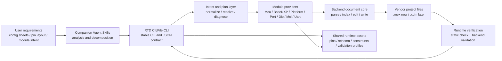

# RTD CfgFile CLI Core Design

| Field | Value |
| --- | --- |
| Version | 0.4.2 |
| Date | 2026-06-02 |
| Author | autoMBD <tkung.lqk@foxmail.com> (AI-assisted) |
| Description | Defines the long-term RTD CfgFile CLI architecture and success criteria. |

## Overview

RTD CfgFile CLI is a CLI-first configuration system for RTD projects. It edits
RTD configuration files according to vendor configuration-tool rules, accepts
structured configuration requests, produces deterministic project changes, and
verifies that the modified project can pass the configured code-generation and
validation flow. Companion Agent Skills are part of the deliverable so AI
agents can analyze user requirements, decompose them into intents or shortcut
commands, run verification, and interpret diagnostics without reading
implementation code.

## Contents

- [Terminology](#terminology)
- [Purpose](#purpose)
- [Goals](#goals)
- [Supported Configuration Backends](#supported-configuration-backends)
- [Architecture](#architecture)
- [Backend Document Core](#backend-document-core)
- [Development Experience Baseline](#development-experience-baseline)
- [Module Capability Model](#module-capability-model)
- [Resource And Constraint Data](#resource-and-constraint-data)
- [Intent And Commands](#intent-and-commands)
- [Runtime Configuration](#runtime-configuration)
- [Diagnostics](#diagnostics)
- [Runtime Verification Pipeline](#runtime-verification-pipeline)
- [Performance Requirements](#performance-requirements)
- [Fixtures](#fixtures)
- [Tests And Acceptance](#tests-and-acceptance)
- [Suggested Project Structure](#suggested-project-structure)
- [Success Criteria](#success-criteria)

## Terminology

| Term | Meaning |
| --- | --- |
| RTD CfgFile CLI | The official tool name. It edits RTD configuration files according to the rules of vendor configuration tools such as S32 ConfigTools and EB tresos, then supports correct code generation and verification through the configured backend flow. |
| Runtime tool | The executable tool and committed runtime assets used in a target environment. It must not depend on development-only source files such as Excel workbooks or raw RTD package descriptors. |
| Development-time source material | Reference material used to build runtime data assets, such as pin mux workbooks, RTD `.xdm` descriptors, vendor examples, and local investigation notes. |
| Deprecated rtd-config skills experience | Development-time experience extracted from prior `.mex` editing skills under `D:\WorkSpace\ExploreSpace\autombd-skills\skills\rtd-config`. It is captured in the active M1 experience baseline and must guide development, but the external skills themselves are not runtime dependencies. |
| Runtime asset | Prepared, versioned repository data loaded by the runtime tool, such as pin mapping JSON, schema/constraint cache, module manifests, and validation profiles. |
| Backend | A supported configuration technology, such as S32 ConfigTools `.mex` or EB tresos project files. Each backend owns its document model, writer, and validation integration. |
| Backend document core | Backend-specific code that parses, indexes, edits, and writes project configuration files while keeping edits localized and diagnosable. |
| Module provider | Code that owns planning and applying configuration for one RTD module or module family. A provider may only write its owned configuration regions. |
| Shared resource service | Cross-module service for resources and constraints, such as pin mapping, schema cache, diagnostics, validation command construction, and performance timing. |
| Intent | A structured request that describes the desired configuration change. JSON intent is the core request format. |
| Shortcut command | A convenience CLI command for common workflows. It must normalize to intent and use the same plan/apply/check/validate pipeline. |
| Plan | The deterministic dry-run result describing intended edits, dependencies, diagnostics, and blockers before writes. |
| Apply | The tool step that performs planned, owned configuration edits in backend project files. |
| Static check | The fast, tool-owned part of runtime verification. It does not launch vendor tools and checks items such as XML well-formedness, ownership boundaries, missing references, invalid resources, and duplicate IDs. |
| Backend validation | The vendor-backed part of runtime verification. It invokes or models the configured backend validator or code-generation flow, such as S32 ConfigTools headless validation for `.mex` projects. |
| Runtime verification | The tool behavior after `.mex`, `.xdm`, or another backend configuration file is modified. It is the umbrella process that includes static check first and backend validation when configured. These stages share one result model but remain separate execution steps for performance, diagnostics, and vendor-authority reasons. |
| Development testing | The implementation acceptance process. Test cases prove tool features, diagnostics, runtime verification behavior, and agent workflows before a feature is accepted. |
| Mandatory minimum test | A development test that must pass for the current milestone to be accepted. Milestone 1 defaults to the mandatory minimum test set only. |
| Advanced test | A current-milestone test that is available for additional coverage but is executed only when the user explicitly requests it. |
| Reserved future test | A known future test case that is outside the current milestone. Its execution plan is decided when the corresponding milestone is planned. |
| Fixture | A real or focused test project used by development tests. Real vendor project fixtures are the preferred source for integration and validation tests. |
| Independent subagent validation | Black-box development validation performed by an isolated subagent using only public deliverables, test input, repository-visible instructions, companion skills, and the public CLI. |
| Subagent user prompt | The simulated user configuration request given to an independent subagent. It must contain only the user-facing configuration demand. |
| Vendor tool environment | The installed S32DS, S32 ConfigTools, EB tresos, RTD packages, and related vendor runtime dependencies used by backend validation. RTD CfgFile CLI must not directly read development source material at runtime, but the vendor validation tool may use its own installed environment internally. |
| Agent Skill | Repository skill documentation that teaches AI agents how to use the tool, prepare intents, run commands, validate results, and react to diagnostics without relying on private implementation details. |
| KPI | A measurable acceptance target. Focused subagent validation should converge within 3 minutes, E2E subagent validation should converge within 5 minutes, and any subagent run longer than 10 minutes requires main-agent intervention and issue collection. |

## Purpose

This project builds RTD CfgFile CLI so AI agents can configure low-level driver
software through a deterministic public CLI instead of operating vendor GUI
tools directly. The long-term target is the full RTD configuration surface:
driver modules, official RTD RTOS integration, stacks, supported external
peripheral driver configuration, S32 ConfigTools `.mex`, EB tresos project
files, multiple S32K families, multiple RTD releases, and modules added over
time.

The stable external contract is the CLI and its JSON input/output. Internal
Python modules should be clear and testable, but the CLI/JSON contract is the
first compatibility boundary.

## Goals

| ID | Goal | Success signal |
| --- | --- | --- |
| G01 | Provide a deterministic CLI for RTD configuration file edits. | The same project, runtime data, tool version, and request produce the same plan, edits, diagnostics, and verification result. |
| G02 | Let AI agents configure RTD projects without directly driving S32 ConfigTools or EB tresos GUI workflows. | Agents can transform user requirements into JSON intents or shortcut commands and complete configuration through RTD CfgFile CLI. |
| G03 | Support AI-agent requirement decomposition through companion skills. | Skills guide agents to analyze multi-signal requirements, communication configuration sheets, Port pin layouts, dependencies, and validation feedback before calling the CLI. |
| G04 | Preserve module ownership boundaries and explicit dependencies. | New modules and set features can be added without entangling provider write ownership or hidden dependency edits. |
| G05 | Support backend extensibility. | S32 ConfigTools `.mex` is implemented first, and EB tresos can reuse the same intent, diagnostics, resources, module capability, and test concepts with a backend-specific document core. |
| G06 | Support device, family, module, and RTD release growth. | Runtime assets and capability metadata can expand from S32K344/S32K3 RTD 7.0.1 to more S32K devices, K1/K5 families, RTD releases, and modules. |
| G07 | Support complete and partially missing configurations through planned capabilities. | When planned for a backend, the tool can safely complete missing module configuration or create configuration files from prepared runtime templates. |
| G08 | Keep routine commands efficient enough for autonomous use. | Inspect, plan, check, resource queries, and focused configuration flows are fast enough for repeated agent use and expose timing data for bottleneck analysis. |
| G09 | Treat vendor-backed validation as the final authority after tool edits. | Runtime verification combines fast static checks with backend validation, and acceptance requires the configured vendor validation path when available. |

## Supported Configuration Backends

The architecture supports multiple configuration backends through backend
providers. Each backend provider owns its file model, validation integration,
and backend-specific write strategy.

| Backend | Configuration format | Primary use |
| --- | --- | --- |
| S32 ConfigTools | `.mex` | S32DS ConfigTools projects |
| EB tresos | `.xdm` and related EB project files | EB tresos projects |

S32 ConfigTools `.mex` is the first backend to implement. EB tresos support
must reuse the same intent, planning, diagnostics, resource cache, module
capability, and testing concepts where practical, while using its own document
model and writer.

## Architecture

Use a modular configuration core with a CLI shell.

The architecture diagram is maintained in two forms:

- inline Mermaid below for Markdown rendering;
- editable Draw.io source at
  `docs/superpowers/specs/figures/rtd-cfgfile-cli-architecture.drawio`.



The architecture has these layers:

1. CLI layer
   Provides core commands and module shortcut commands. Shortcut commands only
   build normalized intent and then use the same plan/apply/check/validate
   pipeline.

2. Agent Skills layer
   Provides repository skills that teach AI agents how to select workflows,
   convert user requests into intents or shortcut commands, call the CLI, run
   runtime verification, and interpret JSON diagnostics. Skills are
   documentation and workflow adapters over the public CLI; they must not
   bypass the CLI contract or depend on private implementation details.

3. Intent and plan layer
   Loads JSON intent or shortcut command arguments, normalizes requests, checks
   constraints, resolves dependencies, and produces deterministic plans before
   writes.

4. Backend document core
   Parses backend project files, builds efficient indexes, provides structured
   editing helpers, performs localized writes, and keeps diffs reviewable.

5. Module providers
   Each module owns its own planning and apply logic. Providers publish their
   supported actions, dependencies, constraints, resources, and tests through a
   maintainable module capability table.

6. Shared resource services
   Provide pin mapping, schema/cache access, references, constraints,
   diagnostics, validation command construction, runtime configuration loading,
   and performance instrumentation.

Two architecture rules are mandatory:

- A module provider may only write the configuration area it owns.
- Shared concerns such as document editing, pin mapping, diagnostics,
  schema/cache, constraints, references, and validation must live in core/shared
  layers, not inside individual module implementations.

Cross-module dependencies are explicit plan relationships. For example, a Uart
request may require Port pins, Mcu clocks, Mcl FlexIO resources, and Platform
interrupts. Uart may declare those requirements, but the owning providers must
plan and apply their own edits.

## Backend Document Core

The document core must be efficient and backend-specific.

For `.mex` projects, the document core should:

- parse project XML and build only the indexes needed by the current command;
- avoid scanning unrelated large subtrees where a targeted index is sufficient;
- allow the indexing strategy to evolve after measuring real project sizes;
- provide setting/container lookup and upsert helpers;
- remove conflicting `quick_selection` attributes from modified elements;
- keep localized edits small enough for review;
- avoid broad whole-file rewrites;
- expose diagnostics instead of raw parser or Python tracebacks.

For EB tresos projects, the `.xdm` writer should follow the same concepts:
structured parsing, targeted indexes, localized edits, explicit constraints,
and stable diagnostics. EB-specific details belong in the EB backend design when
that backend is planned.

## Development Experience Baseline

Milestone 1 `.mex` backend and provider development must use and comply with:

`docs/superpowers/specs/rtd-config-m1-legacy-skills-experience.md`

That document captures practical S32K3 RTD 7.0.1 `.mex` editing experience from
deprecated rtd-config skills, including:

- `quick_selection` handling for modified `config_set`, `struct`, and other
  XML elements;
- module ownership boundaries for Mcu, BaseNXP, Platform, Port, Dio, Mcl, and
  Uart;
- FlexIO-backed Uart dependency flow through Mcl FlexIO common resources;
- known misleading ConfigTools validation symptoms caused by stale
  quick-selection metadata;
- S32DS/S32 ConfigTools headless validation requirements;
- generated-file and `.cproject` metadata preservation rules.

The external deprecated skills are development-time source material only. They
must not be read by runtime commands and must not override the active specs,
runtime assets, fixture evidence, or backend validation results. When the
experience baseline identifies a concrete `.mex` pitfall, M1 implementation
must convert it into tests, diagnostics, or provider rules before accepting the
affected feature.

## Module Capability Model

Module responsibilities are maintained in a separate capability table rather
than embedded only in this spec. The active table is:

`docs/superpowers/specs/rtd-config-module-capabilities.md`

The capability table must support:

- supported actions;
- owned paths or owned configuration regions per backend;
- dependencies and dependency direction;
- constraints and resource limits;
- data/cache files used at runtime;
- shortcut command mappings;
- tests and validation cases.

Different devices and RTD releases can impose different limits, such as
available pins, peripheral counts, interrupt names, and valid enum values. Those
constraints must come from prepared runtime cache data, not from ad hoc code or
runtime vendor-directory scans.

## Resource And Constraint Data

Runtime data is committed as versioned JSON/cache files. Runtime commands must
not require development source material such as Excel workbooks or installed
RTD package files.

Data assets include:

- module manifests and capability metadata;
- schema/constraint cache extracted from vendor configuration descriptions;
- pin mapping by family, device, package, peripheral, signal, and pin;
- validation profiles;
- known generated-file and reference patterns when needed.

Suggested structure:

```text
data/
  s32k/
    families/
      s32k3/
        devices/
          s32k344/
            packages/
              <package>/
                pins.json
            rtd/
              7_0_1/
                schemas/
                modules/
```

Development-time source documents are described in a separate references
document. The spec only defines what kinds of source material are needed:

- pin mux references;
- RTD module `.xdm` or equivalent constraint descriptions;
- ConfigTools project examples;
- vendor validation command references;
- RTD release/package metadata.

The build process may use these materials to create runtime JSON/cache assets.
The runtime tool must only load the prepared assets.

## Intent And Commands

JSON intent is the core request format. Shortcut commands are convenience
wrappers that normalize into the same intent model.

Core commands:

| Command | Purpose | Writes project files | Launches vendor tool |
| --- | --- | --- | --- |
| `rtd-config inspect --project <project> --json` | Detect backend, device, RTD version, enabled modules, existing owned resources, and validation profile. | No | No |
| `rtd-config plan --project <project> --intent intent.json --json` | Normalize intent, resolve dependencies, check constraints, and return planned edits and blockers before writing. | No | No |
| `rtd-config configure --project <project> --intent intent.json --json` | Apply planned owned edits, then run runtime verification according to configuration. | Yes | Configurable |
| `rtd-config check --project <project> --json` | Run static checks only. This is the fast tool-owned stage of runtime verification. | No | No |
| `rtd-config validate --project <project> --json` | Run backend validation only, such as S32 ConfigTools headless validation for `.mex` projects. | No | Yes |
| `rtd-config pin-options --device <device> --package <package> --peripheral <peripheral> --json` | Query prepared runtime pin-mapping data to list valid pins, mux modes, directions, and conflicts for a peripheral signal before planning Port edits. | No | No |

Shortcut commands follow module groupings and normalize to the same intent
model:

| Shortcut group | Example command | Purpose |
| --- | --- | --- |
| `uart` | `rtd-config uart set ...` | Configure Uart logical channels, including LPUART or FlexIO-backed channels, baud/format, polling or interrupt method, callback options, and declared dependencies. |
| `port` | `rtd-config port set-pin ...` | Configure generic pin mux, GPIO direction, electrical settings, untouched resources, and runtime API switches without binding Port logic to one consumer module. |
| `dio` | `rtd-config dio set-channel ...` | Configure Dio ports, channels, channel groups, optional APIs, and partition-related references. |
| `mcu` | `rtd-config mcu set-clock ...` | Configure Mcu clocks, peripheral clock gates, modes, RAM sections, reset behavior, and notifications. |
| `platform` | `rtd-config platform set-irq ...` | Configure Platform-owned interrupt controller entries, priorities, handlers, and other Platform resources such as MPU/MCM/INTM when requested. |
| `basenxp` | `rtd-config basenxp set ...` | Configure BaseNXP/OsIf features such as bare-metal defaults, DET, system/custom timer, OS mode, multicore, user mode, and software semaphore. |
| `mcl` | `rtd-config mcl set-flexio ...` | Configure Mcl-owned shared resources such as FlexIO logic channels for first milestone Uart use, with later expansion for DMA, eMIOS, TRGMUX, LCU, and cache features. |

The CLI must remain non-interactive for automation. Users who need review
should run `plan` before `configure`.

## Runtime Configuration

Use repository or workspace JSON configuration files for default paths and
settings. CLI parameters may override JSON values.

Configuration should cover:

- backend selection;
- S32DS or EB tresos tool roots;
- workspace path;
- default project path when useful;
- default family, device, package, and RTD version;
- runtime data/cache locations;
- validation timeout;
- validation log directory.

The format is JSON to avoid runtime dependencies beyond the Python standard
library.

## Diagnostics

All commands return stable JSON diagnostics:

```json
{
  "status": "passed|failed|blocked",
  "command": "configure",
  "diagnostics": [
    {
      "severity": "blocker|error|warning|info",
      "code": "missing_pin_mapping",
      "module": "port",
      "message": "Pin PTA15 is not available for the requested package/function.",
      "details": {}
    }
  ]
}
```

Diagnostics must be actionable. They should identify the module, invalid or
missing resource, constraint that failed, and useful details for correction.

## Runtime Verification Pipeline

`configure` runs the same high-level pipeline for every backend:

1. load runtime configuration;
2. load and index the project through the backend document core;
3. normalize intent;
4. resolve dependencies and constraints;
5. plan;
6. apply owned edits;
7. run static checks as the fast tool-owned runtime verification stage;
8. run backend validation when configured;
9. return changed modules, diagnostics, validation logs, and status.

S32 ConfigTools validation requirements:

- headless execution without a visible GUI window;
- configurable timeout;
- stdout/stderr/log capture;
- JSON result with command, resolved paths, exit code, and log paths;
- clear failure diagnostics.

The vendor validation tool may use its own configured installation environment
internally, including installed S32DS, ConfigTools, RTD packages, and related
metadata. The runtime boundary means RTD CfgFile CLI itself must not directly
load development-only source material such as Excel workbooks or raw RTD
descriptor files during normal operation.

EB tresos validation should follow equivalent principles once that backend is
introduced.

## Performance Requirements

Commands must be efficient enough for autonomous agent use.

- Runtime commands must not scan RTD installation directories.
- Runtime commands must not read Excel or other development-only source files.
- Inspect, plan, check, and resource-query commands must not launch vendor
  tools.
- A single command should parse/index each project file only as needed and
  reuse indexes across providers.
- Runtime module and resource knowledge must come from committed JSON/cache
  assets.
- The tool must expose enough timing information to identify slow indexing,
  planning, writing, or validation steps.
- If runtime `.mex` parsing or indexing becomes too slow on real projects, the
  document core must support replacing broad indexing with measured targeted
  indexes or prepared project summaries.

## Fixtures

Fixtures use a generic structure. Each fixture is a real vendor project grouped
by backend, family, device, and module. The `projects/` directory under each
module contains one or more real vendor project directories.

```text
fixtures/
  <backend>/
    <family>/
      <device>/
        <module>/
          projects/
            <project>/
```

Fixtures must include the files required for vendor validation and exclude
build/debug/generated artifacts that do not belong in source control.

Specific fixture projects and test scenarios are documented in the test
strategy, not in this spec.

## Tests And Acceptance

The spec requires maintainable test documentation. Test cases, module-specific
test steps, staged coverage, and subagent validation process belong in the test
strategy document.

Independent subagent validation is black-box validation of the delivered tool
and companion skills. The subagent must not receive main-agent context,
implementation notes, hidden assumptions, or development text. It uses only the
public deliverables, test input, repository-visible instructions, and public CLI
to complete the assigned validation target.

Acceptance is based on two criteria:

- the required mandatory minimum test cases for the current milestone pass;
- the KPI for focused module configuration validation is met.

The KPI applies to all module configuration flows: an independent validator
should be able to understand a focused test case, use the public tool
interface, and converge within 3 minutes. E2E validation is allowed a 5-minute
KPI. A subagent run may continue up to 10 minutes to expose useful problem
evidence; after 10 minutes, the main agent intervenes. Repeated KPI failures
mean the interface, diagnostics, performance, companion skills, or test design
must be improved.

## Suggested Project Structure

```text
rtd_config/
  __main__.py
  cli.py
  config.py
  diagnostics.py
  intent.py
  plan.py
  backends/
    base.py
    s32_mex/
      document.py
      index.py
      edit.py
      writer.py
      validation.py
    eb_tresos/
      document.py
      index.py
      edit.py
      writer.py
      validation.py
  modules/
    base.py
    mcu.py
    basenxp.py
    platform.py
    port.py
    dio.py
    mcl.py
    uart.py
  resources/
    pins.py
    schema.py
    constraints.py
  checks/
    static.py
.skills/
  rtd-config/
    <agent-facing workflow skills>
data/
fixtures/
tests/
docs/
  superpowers/
    specs/
      rtd-config-module-capabilities.md
    references/
    tests/
    roadmaps/
```

## Success Criteria

The project is successful when:

- core CLI commands return stable JSON;
- companion Agent Skills guide AI agents through tool usage without relying on
  private implementation details;
- shortcut commands normalize to the same intent pipeline;
- backend document cores can configure vendor projects through structured,
  localized edits;
- `.mex` backend behavior follows the M1 legacy-skills experience baseline;
- module providers preserve ownership boundaries;
- dependencies between modules are explicit in plans;
- constraints come from prepared runtime data assets;
- runtime commands avoid development-only source files and vendor-directory
  scans;
- static and vendor validation diagnostics are actionable;
- module capability tables, references, tests, and roadmaps remain maintainable;
- required test cases pass;
- focused validation meets the 3-minute KPI.

## Changelog

| Date | Version | Description |
| --- | --- | --- |
| 2026-06-02 | 0.4.2 | Added M1 legacy-skills experience baseline requirement and quick-selection handling requirement for `.mex` edits. |
| 2026-06-02 | 0.4.1 | Aligned fixture directory structure with backend/family/device/module/projects/project layout. |
| 2026-06-02 | 0.4.0 | Clarified mandatory, advanced, and reserved tests; updated subagent prompt, KPI, and vendor tool environment terminology. |
| 2026-06-02 | 0.3.0 | Resolved third-round review comments on tool naming, goals, runtime verification, architecture diagram, and CLI command tables. |
| 2026-06-02 | 0.2.4 | Added terminology table to align project concepts. |
| 2026-05-30 | 0.2.3 | Formatted document metadata and changelog as tables. |
| 2026-05-30 | 0.2.2 | Renamed design document to remove date from filename. |
| 2026-05-30 | 0.2.1 | Standardized document metadata and added changelog. |
| 2026-05-30 | 0.2.0 | Integrated second-round review updates and Agent Skills architecture. |
| 2026-05-30 | 0.1.0 | Created initial RTD configuration core design. |
